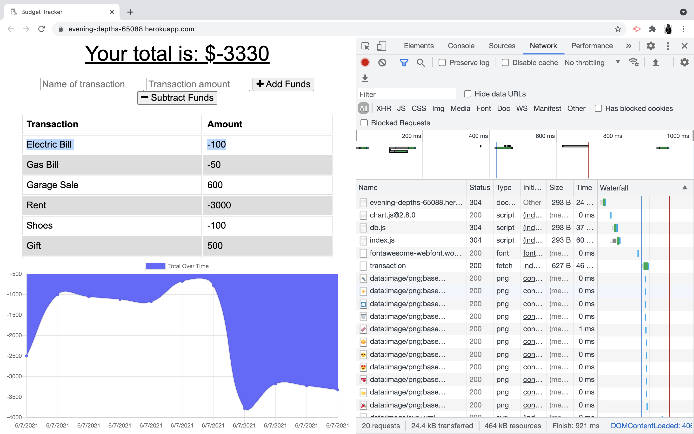

# Budget-Tracker/ 18-pwa

[](https://opensource.org/licenses/MIT)

- [Deployed](https://evening-depths-65088.herokuapp.com/)
- [Repo](https://github.com/yondav/18-pwa)

## About / Synopsis

Budget Tracker is a progressive web app that allows users to keep track of their income and expenses.

---

## Table of contents

> - [Title / Repository Name](#title--repository-name)
>   - [About / Synopsis](#about--synopsis)
>   - [Table of contents](#table-of-contents)
>   - [Installation](#installation)
>   - [Usage](#usage)
>     - [Start Server](#start-server)
>   - [Author](#author)
>     - [Contact](#contact)
>   - [Contributing / Issues](#contributing--issues)
>     - [Contributing](#contributing)
>     - [Reporting Issues](#reporting-issues)
>   - [Technologies](#technologies)
>   - [License](#licenses)

---

## Installation

- Clone repo
- Open integrated terminal on the root directory
- Install dependencies :

```
npm i
```

---

## Usage



- User is able to add to the budget by addition or subtraction.
- If the user updates the budget while without an internet connection, the updates will go to indexDB.
- Once the user establishes a valid internet connection, the `bulk` endpoint will be fetched to bring the database up to date.

---

### Start Server

```
npm start
```

for `nodemon server.js`:

```
npm run watch
```

---

## Author

### Yoni David

- <a href="https://yondav.us/">Portfolio</a>
- <a href="https://github.com/yondav">Github</a>

---

### Contact

Inquiries can be sent to [yoni@yondav.com](mailto:yoni@yondav.com)

## Contributing / Issues

---

### Contributing

- Fork repo
- Make additions and changes on new, personalized branch
- Submit [pull request](https://github.com/yondav/18-pwa/pulls)

---

### Reporting Issues

Report issues by selecting the [issues](https://github.com/yondav/18-pwa/issues) tab and creating a new issue

---

## Technologies

- [Mongo](https://www.mongodb.com/)
- [Mongoose](https://mongoosejs.com/docs/)
- [Morgan](https://www.npmjs.com/package/morgan)

## Licenses

- [MIT](https://github.com/yondav/13-e-commerce-back-end/blob/main/LICENSE)

This README file was built with [README Generator](https://github.com/yondav/README-gen-09)

Copyright &copy; 2021, Yoni David
